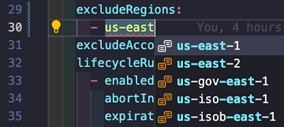

# Using JSON Schema

Landing Zone Accelerator on AWS fully supports [JSON Schema](https://json-schema.org/overview/what-is-jsonschema), empowering you with enhanced configuration validation and auto-completion directly in your IDE.

## Validation

Configuration files are validated in real-time as you type, reducing syntax errors and improving your feedback loop. If any of your configuration files contain an error that does not align with the LZA schema, you will know immediately before pushing your config to CodeCommit.

## Auto-Completion

As you type, you will receive suggestions for configurations straight from the schema, making it easier and faster to edit LZA configuration files.

## Discoverability

By exploring each LZA configuration file using the schema, you will be able to discover what options are available to you without ever leaving the IDE. For example - you can highlight any of the LZA configuration entries to view a description of it. Another example, trigger a suggest (Ctrl/Cmd+Space in VSCode) anywhere in the LZA configuration code to show available options to you.

## Getting Started

This feature is designed to enhance the experience of working with the LZA configuration files and is immediately available. To take advantage of this, open up any of the LZA configuration files in an editor that supports JSON Schema. A few popular IDEs are listed below that have been validated:
* VSCode: requires the YAML extension
* IntelliJ
