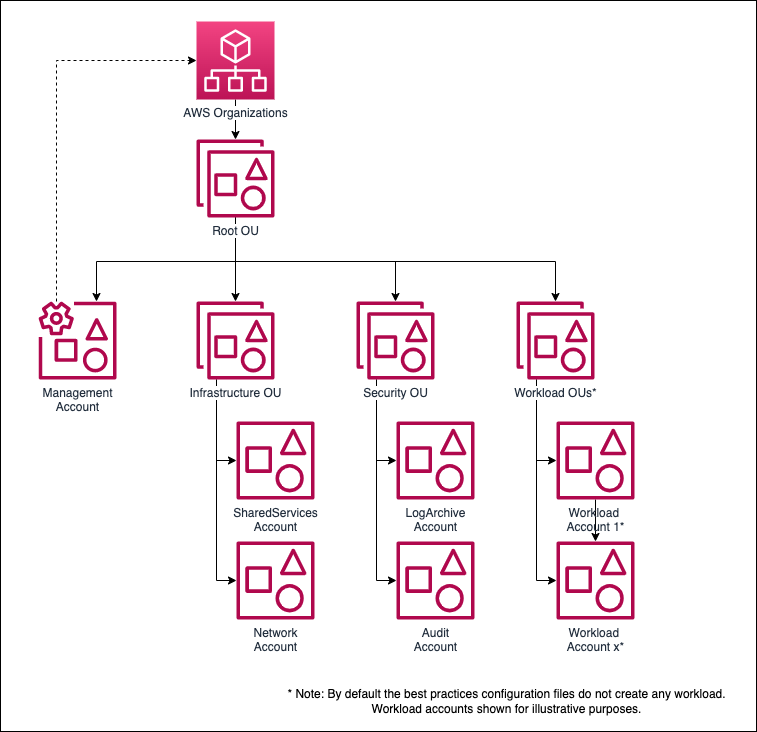

# Organization and Account Structure

## Overview

_Landing Zone Accelerator_ uses AWS Accounts to enforce strong isolation between teams, business units and application functions. The sections below discuss the account design, the sample configuration files create through, [AWS Control Tower](https://aws.amazon.com/controltower/) or [AWS Organizations](https://docs.aws.amazon.com/organizations/latest/userguide/orgs_introduction.html).

## Organization structure

The _Landing Zone Accelerator_ includes the following default AWS organization and account structure.

**Note:** the AWS account structure is strictly a control plane concept - nothing about this structure implies anything about the network architecture or network flows.

### Organization Management (root) AWS Account

The AWS Organization resides in the [Organization Management (root) AWS account](https://docs.aws.amazon.com/prescriptive-guidance/latest/security-reference-architecture/org-management.html) and is traditionally an organization's first AWS account. This account is not used for workloads - it functions primarily as a billing aggregator, and a gateway to the entire cloud footprint for high-trust principals. Additionally, the Organization Management account is where the automation engine or tooling is installed to automate the deployment of the LZA architecture and its security guardrails. As per the best practices resources described above, access to this account must be carefully governed.

## Organizational Units

Underneath the root of the organization, [Organizational Units (OU)](https://docs.aws.amazon.com/organizations/latest/userguide/orgs_getting-started_concepts.html) (OUs) provide a mechanism for grouping accounts into logical collections. LZA makes use of OUs to enforce specific preventative controls through [service control policies (SCPs)](https://docs.aws.amazon.com/organizations/latest/userguide/orgs_getting-started_concepts.html), resource sharing across the organization through [Resource Access Manager](https://aws.amazon.com/ram/), and the ability to apply LZA configurations to groups of accounts e.g. a specific network pattern deployment.

The Default sample configuration files OU structure is shown below:

For further details to help you plan your OU structure beyond the defaults provided by these configuration files, review the [best practices for organizational units](https://docs.aws.amazon.com/whitepapers/latest/organizing-your-aws-environment/benefits-of-using-ous.html) and also the [recommendations on OUs and accounts](https://docs.aws.amazon.com/whitepapers/latest/organizing-your-aws-environment/recommended-ous-and-accounts.html).

### Security OU

The [accounts in this OU](https://docs.aws.amazon.com/whitepapers/latest/organizing-your-aws-environment/security-ou-and-accounts.html) are considered administrative in nature with access often restricted to IT security personnel. The sample configuration files add two accounts to this OU:

- [Security Tooling account](https://docs.aws.amazon.com/prescriptive-guidance/latest/security-reference-architecture/security-tooling.html)
- [Log Archive account](https://docs.aws.amazon.com/prescriptive-guidance/latest/security-reference-architecture/log-archive.html)

### Infrastructure OU

The [accounts in this OU](https://docs.aws.amazon.com/whitepapers/latest/organizing-your-aws-environment/infrastructure-ou-and-accounts.html) are also considered administrative in nature with access often restricted to IT operations personnel. The sample configuration files add two accounts to this OU:

- [Network account](https://docs.aws.amazon.com/prescriptive-guidance/latest/security-reference-architecture/network.html)
- [Shared Services account](https://docs.aws.amazon.com/prescriptive-guidance/latest/security-reference-architecture/shared-services.html)

## Core Accounts

Core accounts can be defined as accounts that have special significance within the organization. Often these will provide functions shared across accounts within the organization, for example, centralized logging or network services.

The Landing Zone Accelerator deployment enforces a subset of core accounts as defined in the [mandatory accounts section of the implementation guide](https://docs.aws.amazon.com/solutions/latest/landing-zone-accelerator-on-aws/mandatory-accounts.html). The sample configuration adds additional core accounts for the specific functions listed below.

- [Management account](https://docs.aws.amazon.com/prescriptive-guidance/latest/security-reference-architecture/org-management.html)
- [Audit account (Security Tooling)](https://docs.aws.amazon.com/prescriptive-guidance/latest/security-reference-architecture/security-tooling.html)
- [Log Archive account](https://docs.aws.amazon.com/prescriptive-guidance/latest/security-reference-architecture/log-archive.html)
- [Network account (Transit)](https://docs.aws.amazon.com/prescriptive-guidance/latest/security-reference-architecture/network.html)
- [Shared Services account](https://docs.aws.amazon.com/prescriptive-guidance/latest/security-reference-architecture/shared-services.html)

## Workload Accounts

[Workload (Application) accounts](https://docs.aws.amazon.com/prescriptive-guidance/latest/security-reference-architecture/application.html) are created on demand and placed into an appropriate OU in the organization structure. The purpose of workload accounts is to provide a secure and managed environment where project teams can use AWS resources. They provide an isolated control plane so that the actions of one team in one account cannot inadvertently affect the work of teams in other accounts.

## Account Level Security Settings

The LZA sample configuration files enable certain account-wide features on account creation. Namely, these include:

1. [S3 Public Access Block](https://docs.aws.amazon.com/AmazonS3/latest/dev/access-control-block-public-access.html#access-control-block-public-access-options)
2. [Default encryption of EBS volumes](https://docs.aws.amazon.com/AWSEC2/latest/UserGuide/EBSEncryption.html#encryption-by-default) using a customer managed local account KMS key
3. [Tagging policy](https://github.com/awslabs/landing-zone-accelerator-on-aws/blob/main/reference/sample-configurations/lza-sample-config/tagging-policies/org-tag-policy.json) applied to the root OU via the [organization-config.yaml **taggingPolicies** key](https://github.com/awslabs/landing-zone-accelerator-on-aws/blob/main/reference/sample-configurations/lza-sample-config/organization-config.yaml). To help you define a tagging policy that meets your organizations see [AWS tagging best practices](https://docs.aws.amazon.com/organizations/latest/userguide/orgs_manage_policies_tag-policies-best-practices.html). You can then amend the example tagging policy provided by these configuration files.
4. [Backup Policy](https://github.com/awslabs/landing-zone-accelerator-on-aws/blob/main/reference/sample-configurations/lza-sample-config/backup-policies/backup-plan.json) applied to the root OU via the [organization-config.yaml **backupPolicies** key](https://github.com/awslabs/landing-zone-accelerator-on-aws/blob/main/reference/sample-configurations/lza-sample-config/organization-config.yaml).